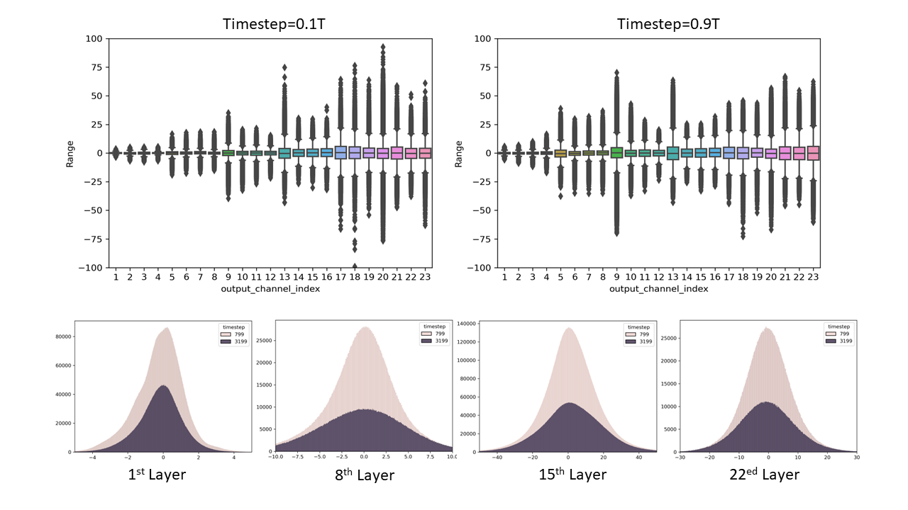

# PTQ4DM: Post-training Quantization on Diffusion Models    
Yuzhang Shang^*^, Zhihang Yuan*, Bin Xie, Bingzhe Wu, and Yan Yan    

The code for the Post-training Quantization on Diffusion Models, which has been accepted to CVPR 2023. [paper](https://arxiv.org/abs/2211.15736)

    

**_Key Obersevation_**: Studies on the activation distribution w.r.t. time-step. **(Upper)** Per (output) channel weight ranges of the first depthwise-separable layer in diffusion model on different timestep. In the boxplot, the min and max values, the 2nd and 3rd quartile, and the median are plotted for each channel. We only include the layers in the decoder of UNet for noise estimation, as the ranges of the encoder and decoder are quite different. **(Bottom)** Histograms of activations on different time-steps by various layers. We can observe that the distribution of activations changes dramatically with time-step, which makes **<u>traditional single-time-step PTQ calibration methods inapplicable for diffusion models</u>**.

## Quick Start
First, download our repo:
```bash
git clone https://github.com/42Shawn/PTQ4DM.git
cd PTQ4DM
```
Then, run the DNTC script:
```bash
bash quant_sample_ddim_in_backword_DNTC.sh
```

**Demo Result**   
baseline (full-precision IDDPM) => 8-bit PTQ4DM    
           FID 21.7 => 24.3

# Reference
If you find our code useful for your research, please cite our paper.
```
@inproceedings{
shang2023ptqdm,
title={Post-training Quantization on Diffusion Models},
author={Yuzhang Shang and Zhihang Yuan and Bin Xie and Bingzhe Wu and Yan Yan},
booktitle={CVPR},
year={2023}
}
```

**Related Work**    
Our repo is modified based on the Pytorch implementations of Improved Diffusion ([IDDPM](https://github.com/openai/improved-diffusion), ICML 2021) and QDrop ([QDrop](https://github.com/wimh966/QDrop), ICLR 2022). Thanks to the authors for releasing their codebases!
